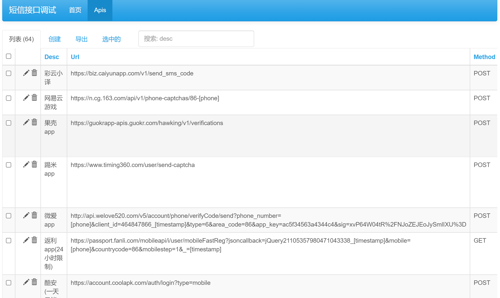
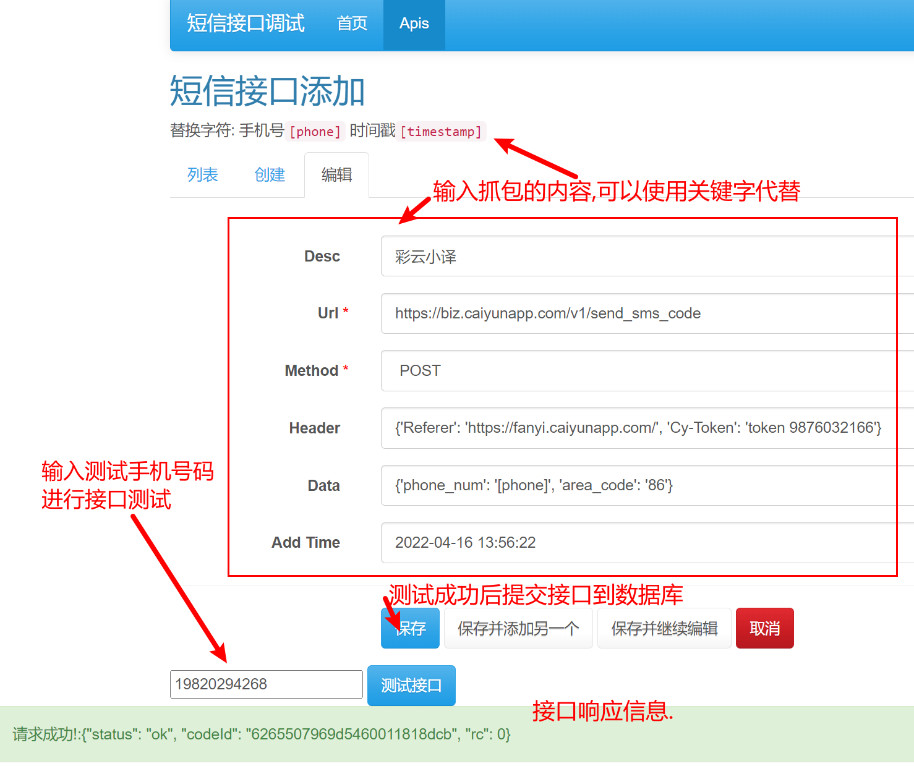

**基于SMSBoom项目的增强和代码优化**


## 原有Feature

1. 通过自定义 `api.json` 的方式定义接口.  
2. 支持关键字替换. **时间戳** `[timestamp]` **手机号** `[phone]`  
3. 多线程/异步 请求.  
4. 通过 Flask 提供网页测试/添加接口.  
5. 友好的命令行参数支持.  
6. ~~采用方便的 pipenv 包管理.~~  
7. ~~通过代理调用短信接口, 支持http, socks4, socks5代理.~~
8. 使用随机的User-Agent.
9. ~~可指定轰炸次数, 轰炸间隔时间.~~

## 增加Feature

1. 增加也可通过代理调用异步请求
2. 使用ProxyPool获取代理替换原有的读取代理接口文件获取代理
3. 更多的随机的User-Agent
4. 不再需要指定轰炸次数，只需指定间隔时间，即可实现循环轰炸，直到想停

## Quick Start

* ### 部署ProxyPool

  >* 克隆代码
  >
  >  ```bash
  >  git clone https://github.com/Python3WebSpider/ProxyPool.git
  >  cd ProxyPool
  >  ```
  >
  >* 使用 Docker
  >
  >  安装如下环境：
  >
  >  - Docker
  >  - Docker-Compose
  >
  >  安装方法自行搜索即可。
  >
  >  ```bash
  >  docker-compose up
  >  ```
  >
  >  运行结果类似如下：
  >
  >  ```bash
  >  redis        | 1:M 19 Feb 2020 17:09:43.940 * DB loaded from disk: 0.000 seconds
  >  redis        | 1:M 19 Feb 2020 17:09:43.940 * Ready to accept connections
  >  proxypool    | 2020-02-19 17:09:44,200 CRIT Supervisor is running as root.  Privileges were not dropped because no user is specified in the config file.  If you intend to run as root, you can set user=root in the config file to avoid this message.
  >  proxypool    | 2020-02-19 17:09:44,203 INFO supervisord started with pid 1
  >  proxypool    | 2020-02-19 17:09:45,209 INFO spawned: 'getter' with pid 10
  >  proxypool    | 2020-02-19 17:09:45,212 INFO spawned: 'server' with pid 11
  >  proxypool    | 2020-02-19 17:09:45,216 INFO spawned: 'tester' with pid 12
  >  proxypool    | 2020-02-19 17:09:46,596 INFO success: getter entered RUNNING state, process has stayed up for > than 1 seconds (startsecs)
  >  proxypool    | 2020-02-19 17:09:46,596 INFO success: server entered RUNNING state, process has stayed up for > than 1 seconds (startsecs)
  >  proxypool    | 2020-02-19 17:09:46,596 INFO success: tester entered RUNNING state, process has stayed up for > than 1 seconds (startsecs)
  >  ```
  >
  >  验证是否搭建成功，可访问 http://localhost:5555/random 即可获取一个随机可用代理
  >
  >  往后想要再次启动，只需要进入到ProxyPool代码文件夹，桥下命令
  >
  >  ```bash
  >  docker-compose start
  >  ```

* ## 部署Boom

  >* 克隆代码
  >* 

### 适用于大佬

#### 下载项目

- 方法一：使用Git:  

```shell
git clone https://github.com/AdminWhaleFall/SMSBoom.git/
```

> 墙国加速
>  
> ```shell
> git clone https://github.do/https://github.com/AdminWhaleFall/SMSBoom.git
> ```

- 方法二：点击下载[项目压缩包](https://github.com/AdminWhaleFall/SMSBoom/archive/refs/heads/master.zip)并解压.  

#### 配置环境  

**前提条件:** 请确保自己的电脑有 `python3.x` 的环境,推荐使用 `3.8` 及以上!  

方案一: 有 `Python3.8` 环境的可以使用 `pipenv` 工具.

1. 安装 pipenv 包管理工具.  
```shell
pip install pipenv
```

2. 为项目构建虚拟环境.  
```shell
pipenv install  # 仅使用轰//炸功能
pipenv install --dev # 使用 webui 调试接口功能.
```

3. 尝试运行 smsboom.py  
```shell
pipenv shell # 激活虚拟环境
python smsboom.py  # linux
```

若无报错，输出帮助信息，则说明环境已经正确安装。若报错请使用方案二

方案二: 只有 `Python3.X` 环境的需要使用原生 `pip` 工具.

1. 安装所需要的库
```shell
pip install -r requirements.txt # 仅使用轰//炸
pip install -r requirements-dev.txt # 使用 webui
```

2. 尝试运行 smsboom.py
```shell
python smsboom.py 
```

若无报错，输出帮助信息，则说明环境已经正确安装。

#### 使用 Docker 运行

##### 方式一: 一键运行

```shell
docker run --rm lanqsh/smsboom run -t 1 -p {PHONE} -i 1
```

#####  方式二: 自建镜像

**前提条件:** 请确保当前环境已安装 [Docker](https://docs.docker.com/get-docker/).

1. 构建镜像

```shell
docker build -t whalefell/smsboom .
```

2. 尝试运行

```shell
docker run --rm whalefell/smsboom:latest --help

Usage: smsboom.py [OPTIONS] COMMAND [ARGS]...

Options:
  --help  Show this message and exit.

Commands:
  asyncrun  以最快的方式请求接口(真异步百万并发)
  onerun    单线程(测试使用)
  run       传入线程数和手机号启动轰炸,支持多手机号
  update    从 github 获取最新接口
```

#### 运行  

若使用虚拟环境,请先激活. `pipenv shell`

```shell
# 输出帮助信息
python smsboom.py --help

Usage: smsboom.py [OPTIONS] COMMAND [ARGS]...    
Options:
--help  Show this message and exit.
Commands:
run     传入线程数和手机号启动轰//炸,支持多手机号
update  从 github 获取最新接口
```

- 启动轰//炸  

帮助信息:

```shell
python smsboom.py run --help

Usage: smsboom.py run [OPTIONS]

传入线程数和手机号启动轰//炸,支持多手机号

Options:
-t, --thread INTEGER       线程数(默认64)
-p, --phone TEXT           手机号,可传入多个再使用-p传递  [required]
-f, --frequency INTEGER    执行次数(默认1次)
-i, --interval INTEGER     间隔时间(默认60s)
-e, --enable_proxy BOOLEAN 开启代理(默认关闭)
--help                     Show this message and exit.
```

### 使用代理

本项目不能通过API自动获取代理, 你可以从下面的免费代理网站中手动获取代理, 或是选择使用自己的代理, 或是不使用代理.

> [https://proxyscrape.com/free-proxy-list](https://proxyscrape.com/free-proxy-list)

> [https://openproxy.space/list](https://openproxy.space/list)

将代理添加到 `http_proxy.txt` `socks4_proxy.txt` `socks5_proxy.txt` 三个文件中, 命令参数添加 `-e` 执行即可.

### 命令示例

启动64个线程,轰//炸一个人的手机号(198xxxxxxxx),只轰//炸一波。

```shell
python smsboom.py run -t 64 -p 198xxxxxxxx
```

启动64个线程,轰//炸一个人的手机号(198xxxxxxxx),启动循环轰//炸, 轮番轰//炸60次

```shell
python smsboom.py run -t 64 -p 198xxxxxxxx -f 60
```

启动64个线程,轰//炸一个人的手机号(198xxxxxxxx),启动循环轰//炸, 轮番轰//炸60次, 每次间隔30秒

```shell
python smsboom.py run -t 64 -p 198xxxxxxxx -f 60 -i 30
```

启动64个线程,轰//炸一个人的手机号(198xxxxxxxx),启动循环轰//炸, 轮番轰//炸60次, 每次间隔30秒, 开启代理列表进行轰炸

```shell
python smsboom.py run -t 64 -p 198xxxxxxxx -f 60 -i 30 -e
```

启动64个线程,轰//炸多个人的手机号(198xxxxxxxx,199xxxxxxxx),启动循环轰//炸, 轮番轰炸60次, 每次间隔30秒, 开启代理列表进行轰炸

```shell
python smsboom.py run -t 64 -p 198xxxxxxxx -p 199xxxxxxxx -f 60 -i 30 -e
```

## Development

程序提供接口调试工具，但目前还不完善，欢迎前端大佬 PR。  
调试工具以 `Flask` 为后端，`vue` 为前端，实现前后端分离。  
目前只有测试接口，添加接口的功能。

### Flask 前端调试

> **前提是已经根据前文 Quick Start 的方式安装好 pipenv 环境**

```shell
pipenv shell # 激活虚拟环境
python run_flask_app.py start -p 9090 # 监听9090端口
提示ModuleNotFoundError: No module named 'xxx' 可使用pip install model_name
```

**运行帮助:**
```shell
Usage: run_flask_app.py [OPTIONS] COMMAND [ARGS]...

Options:
  --help  Show this message and exit.

Commands:
  init         初始化数据库
  json2sqlite  将json数据转为sqlite数据库
  sqlite2json  将sqlite数据转为json
  start        启动 flask app
```

```shell
Usage: run_flask_app.py start [OPTIONS]

  启动 flask app

Options:
  -h, --host TEXT     监听地址
  -p, --port INTEGER  监听端口
  --help              Show this message and exit.
```

默认监听 *0.0.0.0:9090* 地址,浏览器访问[http://127.0.0.1:9090/admin/](http://127.0.0.1:9090/admin/)若无意外,就可以出现前端调试界面。

  
  

## 赞助
[爱发电🔗](https://afdian.net/@smsboom)  

> 赞助的金额将用于我每月治疗 **抑/郁症** 的支出.谢谢大家的支持和鼓励! **比心ing**


## Star ♥ 趋势图


## ✨讨论

欢迎加入讨论对项目提出问题和建议！！！mua!

### 企鹅🐧群
> 企鹅群不允许讨论相关敏感信息!违者上飞机票✈

2022/7/6 停止运作.

### Telegram Channel (TG群组)
> 涉及敏/感信息,政/治,民/主运动话题请到 **TG群聊**

[SMSBoomPr](https://t.me/SMSBoomPr)
